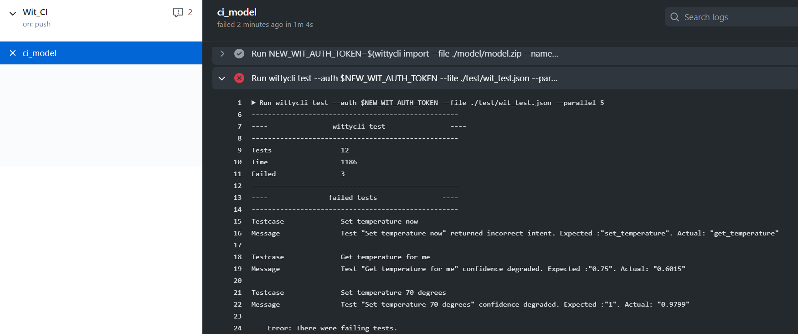
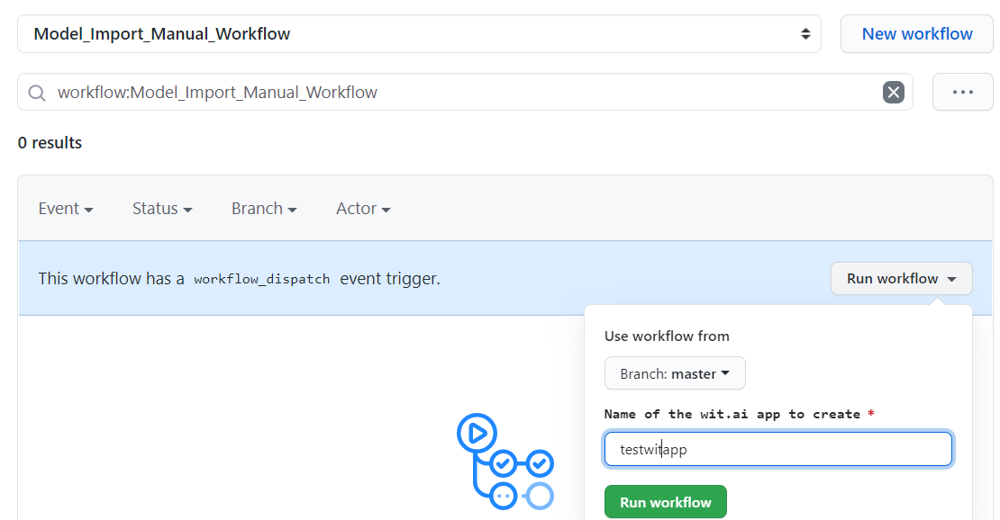

# Configuring Wit.ai CI with GitHub Actions using Wit.ai CLI

## Overview

Using this tutorial, you will be able to:

- Create a production-ready solution using Wit.ai
- Implement Continuous Integration/DevOps best practices using GitHub Actions
- Work together with other engineers and data scientist on the natural language understanding model at the same time
- Track the changes
- Test the model
- Choose the best model based on test results
- Iterate to improve Wit.ai model

## Prerequisites

- [Wit.ai](https://wit.ai/) account
- [GitHub](https://github.com/) account
- Get familiar with [wittycli](https://www.npmjs.com/package/wittycli) - Wit.ai cli that was created for this tutorial

## Train the Wit.ai model

Let's create a sample Wit.ai model first.
We have only two intents for demo purposes and use 5 utterances for training:
| Intent | #1 utterance | #2 utterance  | #3 utterance|
| ------- | --- | --- | ---|
| get_temperature | Is it hot? | Tell me the temperature | What's the current temperature? |
| set_temperature | Set temperature to 70 degrees|lower the temperature by 10 degrees||

## Add model to the GitHub repo
Let's commit our model to the repo now.
To do that we can use [Wittycli](https://www.npmjs.com/package/wittycli) to download the existing model (.zip file) or you can use the [model](./model/model.zip) from this repo. 
We add zip model and unzipped files like app.json to the GitHub repo to see the diff with the main branch (it will be easier for reviewers to compare changes, we still need to keep the zipped model in the repo).
Each time you push new files to your branch (zipped and extracted model) it will trigger the CI pipeline that will run the set of test cases against that model and show you the test results.

## Test Wit.ai model

Let's create a file with test cases.
It is a [./test/wit_test.json](./test/wit_test.json) file that you can find in this repo.
This file should contain a JSON array with objects in the following format:
- text: utterance that you will use to query you Wit.ai model
- expected intent - an intent that you expect your model should return 
(if the model didn't return the expected intent maybe you will need to provide more utterances to test it with)
- confidence - you can specify a threshold for each test case. The value should be between 0 and 1. For example, 0.9 means that want your model to be 90% (or more) sure about the correct intent.
```js
{
    "text": "Get temperature", // <- utterance
    "intents": [
        {
            "name": "get_temperature", // <- expected intent
            "confidence": 0.75 // <- confidence
        }
    ]
}
```

## GitHub Actions workflow

Let's use GitHub Actions to build CI for Wit.ai. Add WIT_AUTH_TOKEN secret to the secrets in GitHub repo Settings. It should have a value of the Server Access Token from any app in Wit.ai. 
 Now let's create a file [.github/workflows/wit_ci.yml](.github/workflows/wit_ci.yml) in your repo that defines the ci. Let's have a look at what it does.

First, we install the wittycli npm package in our CI workflow. 
```
      - run: npm install -g wittycli
```
Second, using wittycli we import the model that we committed in the repo to Wit.ai using existing WIT_AUTH_TOKEN.
We save a new auth token for the model that we just imported as a NEW_WIT_AUTH_TOKEN environment variable.
```
      - run: |
          NEW_WIT_AUTH_TOKEN=$(wittycli import --file ./model/model.zip --name "witcli${{ github.run_id }}" --private --dot access_token --wait)
          echo "::set-env name=NEW_WIT_AUTH_TOKEN::$NEW_WIT_AUTH_TOKEN"
        env: 
          WIT_AUTH_TOKEN: ${{ secrets.WIT_AUTH_TOKEN }} 
```
Internally wittycli uses the value of the WIT_AUTH_TOKEN env variable to authenticate all requests made to Wit.ai.

Third, on every new change you make to the model, it runs tests using wittycli functionality. To test we need to provide a file with the test cases, auth token for the model, also you can specify the level of parallelism.
```
      - run: wittycli test --auth $NEW_WIT_AUTH_TOKEN --file ./test/wit_test.json --parallel 5
```

Results of the test run you can find in the GitHub Actions run: 




GtHub Actions pipeline is located in [.github/workflows/wit_ci.yml](.github/workflows/wit_ci.yml) in this repo.

## Review and continue improving your Wit.ai app

From our GitHub action run we see that 3 tests fail, so let's add additional utterances to the model and train our model with more utterances. Generally, it's a good idea to not modify the existing prod version of the Wit.ai app. That's why we will create a duplicate app for improving of the model. 
To do that we can import the existing model to the Wit.ai portal using [import_wit_model.yml](.github/workflows/import_wit_model.yml) GitHub Actions workflow that you can trigger manually.


Before you will trigger it manually you can specify Wit.ai model name.
After you imported it using manual workflow in GitHub Actions and modified it from the Wit.ai portal, you can perform the same steps as before: 
- Download the model from the Wit.ai portal using wittlycli or Wit.ai UI
- Commit it to your repo. 

CI automatically starts running the tests after the change and we can see if the changed model performs better and resolves intents with a higher score.

## Next Steps

For demonstration purposes, we’ve created the GitHub Actions workflow, but you can use Wit.AI CLI locally. Also, we plan to release a sample in Azure DevOps as well soon.

We look forward to seeing what you will develop using our sample of GitHub Actions workflow and using Witty CLI. Feel free to create issues or PRs in both repos: 
* [Witty CLI GitHub repo](https://github.com/ShyykoSerhiy/wittycli)
* [Wit.ai CI with GitHub Actions tutorial]()
## Related Content

* [Witty CLI GitHub repo](https://github.com/ShyykoSerhiy/wittycli)
* [Wit GitHub](https://github.com/wit-ai)
* [Wit Blog](https://wit.ai/blog)
* [GitHub Actions](https://docs.github.com/en/free-pro-team@latest/actions)

## License

[LICENSE](LICENSE) file.