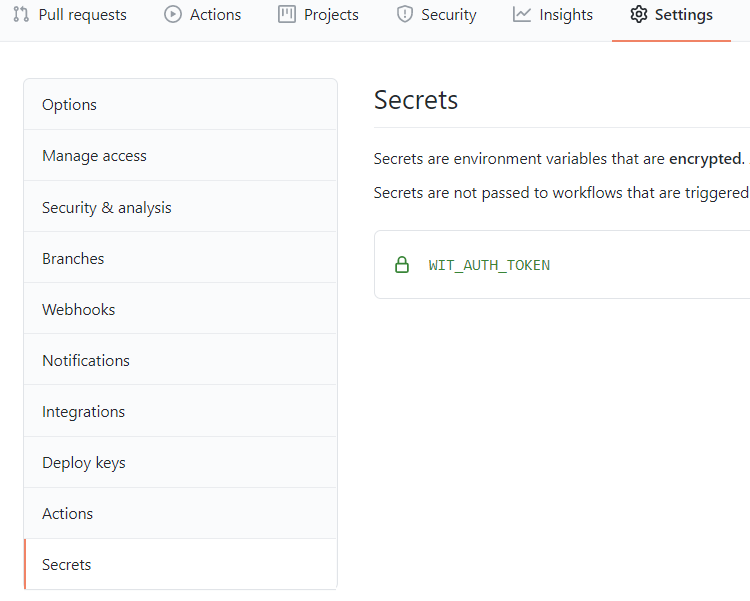
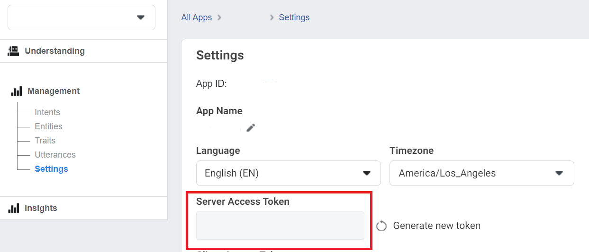
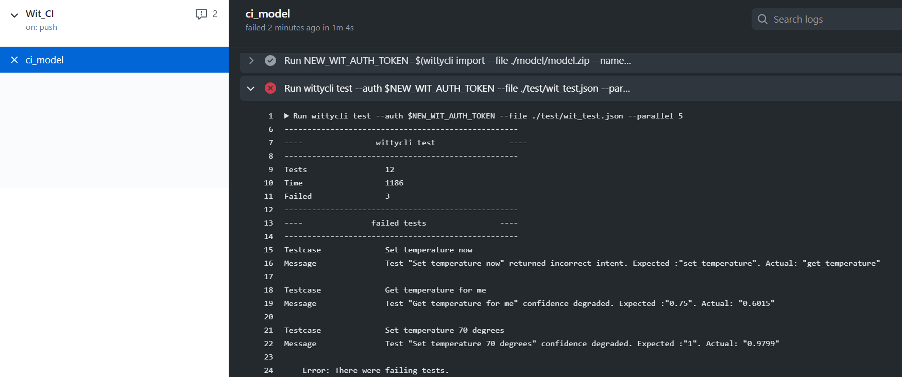
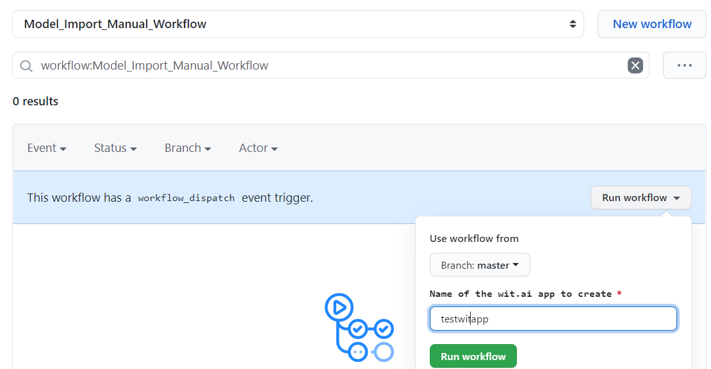

# CI using GitHub Actions workflows

Let's use GitHub Actions to build CI for Wit.ai.

Add WIT_AUTH_TOKEN secret to the secrets in GitHub repo Settings.

 It should have a value of the Server Access Token from any app in Wit.ai. 
 Now let's create a file [.github/workflows/wit_ci.yml](.github/workflows/wit_ci.yml) in your repo that defines the CI. Let's have a look at what it does.

First, we install the wittycli npm package in our CI workflow.

```yaml
      - run: npm install -g wittycli
```

Second, using wittycli we import the model that we committed in the repo to Wit.ai using existing WIT_AUTH_TOKEN.
We save a new auth token for the model that we just imported as a NEW_WIT_AUTH_TOKEN environment variable.

```yaml
      - run: |
          NEW_WIT_AUTH_TOKEN=$(wittycli import --file ./model/model.zip --name "witcli${{ github.run_id }}" --private --dot access_token --wait)
          echo "::set-env name=NEW_WIT_AUTH_TOKEN::$NEW_WIT_AUTH_TOKEN"
        env:
          WIT_AUTH_TOKEN: ${{ secrets.WIT_AUTH_TOKEN }}
```

Internally wittycli uses the value of the WIT_AUTH_TOKEN env variable to authenticate all requests made to Wit.ai.

Third, on every new change you make to the model, it runs tests using wittycli functionality. To test we need to provide a file with the test cases, auth token for the model, also you can specify the level of parallelism.

```yaml
      - run: wittycli test --auth $NEW_WIT_AUTH_TOKEN --file ./test/wit_test.json --parallel 5
```

Results of the test run you can find in the GitHub Actions run:



GtHub Actions workflow is located in [.github/workflows/wit_ci.yml](.github/workflows/wit_ci.yml) in this repo.

## Review and continue improving your Wit.ai app in GitHub

From our GitHub action run we see that 3 tests fail, so let's add additional utterances to the model and train our model with more utterances. Generally, it's a good idea to not modify the existing prod version of the Wit.ai app. That's why we will create a duplicate app for improving of the model.
To do that we can import the existing model to the Wit.ai portal using [import_wit_model.yml](.github/workflows/import_wit_model.yml) GitHub Actions workflow that you can trigger manually.


Before you will trigger it manually you can specify Wit.ai model name.
After you imported it using manual workflow in GitHub Actions and modified it from the Wit.ai portal, you can perform the same steps as before:

- Download the model from the Wit.ai portal using wittlycli or Wit.ai UI
- Commit it to your repo.

CI automatically starts running the tests after the change and we can see if the changed model performs better and resolves intents with a higher score.

GtHub Actions workflows are located in [.github/workflows/](../.github/workflows/) folder in this repo.
